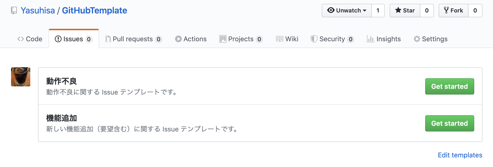
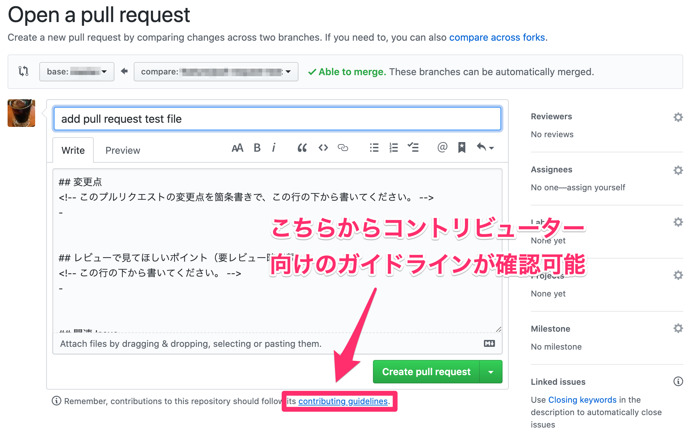
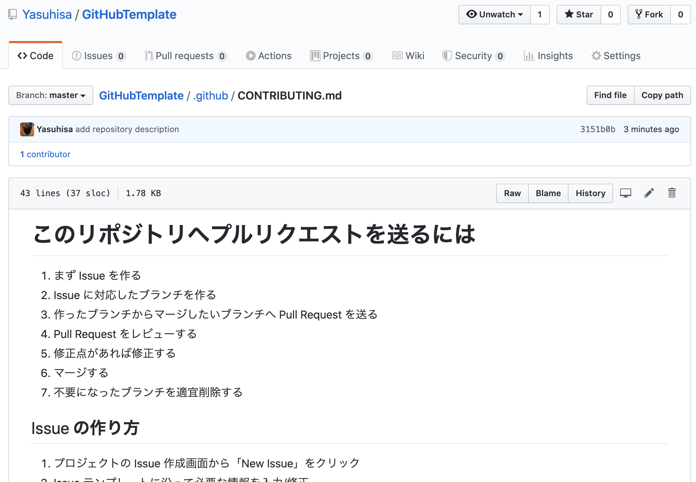

## このリポジトリについて
このリポジトリでは GitHub Issue / Pull Request のテンプレートを公開しています。

テンプレートを導入することで Issue / Pull Request 作成時の文章が自動で入力され、スムーズにチーム開発が行えます。また、プルリクエスト作成時コントリビューター向けにガイドラインが表示されるようになります。







## 使い方
このリポジトリの `.github` ディレクトリを GitHub でホスティングしているご利用のリポジトリの直下（ルートディレクトリ）へ移動してください。


## テンプレートの追加・変更方法
### Issue の追加・変更
ISSUE_TEMPLATE ディレクトリ `.github/ISSUE_TEMPLATE` に `テンプレート名.md` ファイルを追加・変更してください。

### Pull Request の変更
PULL_REQUEST_TEMPLATE `.github/PULL_REQUEST_TEMPLATE.md` ファイルを変更してください。

### テンプレートにラベルを追加する
テンプレート先頭箇所の YAML フォーマッターにカンマ区切りでラベルが追加できます。

■ ラベルの追加例

```yaml
name: 動作不良
about: 動作不良に関する Issue テンプレートです。
labels: bug, alert, high
```

### その他のデフォルト入力項目を指定する
文末のリンクをご参考に、YAML フォーマッター内へ追加してください。

## 連絡先
このリポジトリについて何かございましたら [Twitter](https://twitter.com/pakorepqu) へお気軽にご連絡ください。

## 参考リンク
- [リポジトリ用の単一 Issue テンプレートを手動で作成する - GitHub ヘルプ](https://help.github.com/ja/github/building-a-strong-community/manually-creating-a-single-issue-template-for-your-repository)