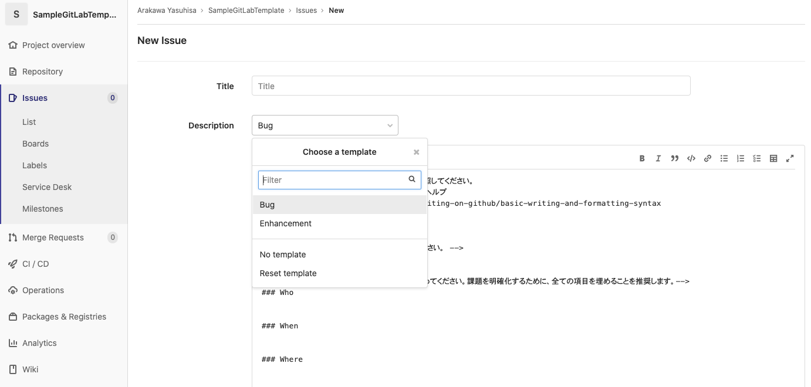
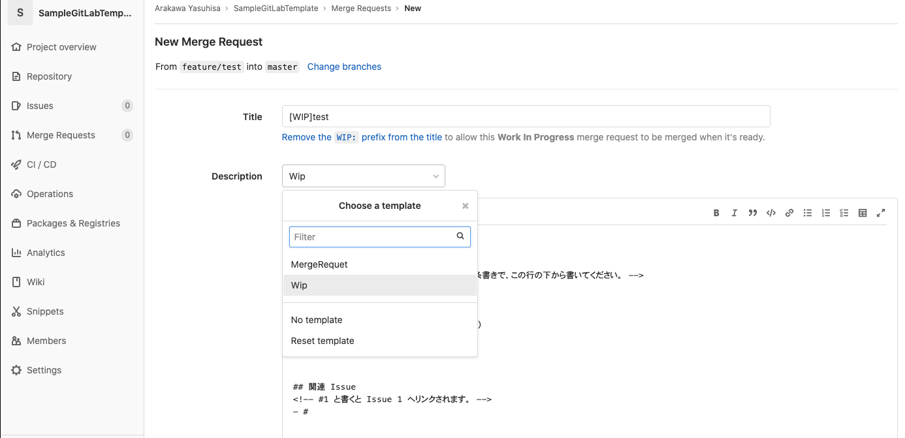

## このリポジトリについて
このリポジトリでは GitHub, GitLab の Issue / Pull Request(Merge Request) のテンプレートを公開しています。

テンプレートを導入することで Issue / Pull Request(Merge Request) 作成時の文章が自動で入力され、スムーズにチーム開発が行えます。また、プルリクエスト作成時コントリビューター向けにガイドラインが表示されるようになります。


---





## 使い方
このリポジトリの `.github` ディレクトリを GitHub でホスティングしているご利用のリポジトリの直下（ルートディレクトリ）へ移動してください。

GitLab の場合は、`.gitlab` ディレクトリをご利用のリポジトリの直下（ルートディレクトリ）へ移動してください。

## テンプレートの追加・変更方法
### Issue の追加・変更
#### GitHub
ISSUE_TEMPLATE ディレクトリ `.github/ISSUE_TEMPLATE` に `テンプレート名.md` ファイルを追加・変更してください。

#### GitLab
issue_templates ディレクトリ `.gitlab/issue_templates` に `テンプレート名.md` ファイルを追加・変更してください。

### Pull Request の変更
#### GitHub
PULL_REQUEST_TEMPLATE `.github/PULL_REQUEST_TEMPLATE.md` ファイルを変更してください。

#### GitLab (Merge Request)
merge_request_templates ディレクトリ `.gitlab/merge_request_templates` に `テンプレート名.md` ファイルを追加・変更してください。

### テンプレートにラベルを追加する (GitHub)
テンプレート先頭箇所の YAML フォーマッターにカンマ区切りでラベルが追加できます。

■ ラベルの追加例

```yaml
name: 動作不良
about: 動作不良に関する Issue テンプレートです。
labels: bug, alert, high
```

### その他のデフォルト入力項目を指定する
文末のリンクをご参考に、YAML フォーマッター内へ追加してください。

## 連絡先
このリポジトリについて何かございましたら [Twitter](https://twitter.com/pakorepqu) へお気軽にご連絡ください。

## 参考リンク
- [リポジトリ用の単一 Issue テンプレートを手動で作成する - GitHub ヘルプ](https://help.github.com/ja/github/building-a-strong-community/manually-creating-a-single-issue-template-for-your-repository)